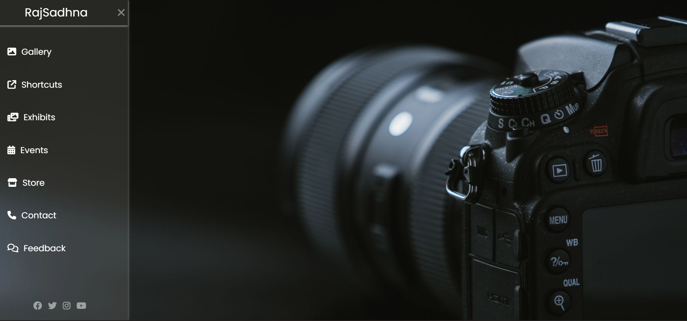

# 📸 Photography Studio Navbar

A responsive and interactive navigation bar for a modern photography studio website. Built with **HTML**, **CSS**, and **Font Awesome**, this sidebar menu features a toggleable design, smooth transitions, and social media links — ideal for portfolios, galleries, events, and more.

## 🌐 Webpage Preview

## 🔍 Features

- ✅ Responsive sidebar toggle menu  
- ✅ Font Awesome icons integration  
- ✅ Smooth transitions & hover effects  
- ✅ Social media icons  
- ✅ Custom Google Font (`Poppins`)

## 🛠️ Technologies Used

- HTML5  
- CSS3  
- Font Awesome  
- Google Fonts  

## 📁 Project Structure
Photography-Studio-Navbar/
│
├── index.html # Main HTML structure
├── style.css # All custom styles
├── photo.jpg # Background or theme image
├── image.png # Screenshot for README preview
└── README.md # Project description
